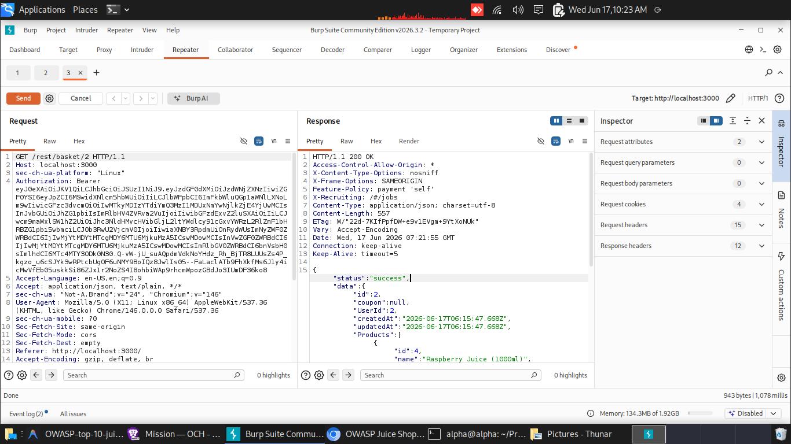

# Juice Shop Penetration Test Report
**Tester:** Victor Oduor  
**Date:** 2026-06-17  
**Target:** OWASP Juice Shop - v19.3.1 @ http://localhost:3000 (local Docker)  
**Scope:** Local instance only. Out of scope: host OS, Docker daemon, DoS testing.

## Executive Summary
These are the findings from the penetration test of OWASP Juice Shop - v19.3.1 @ http://localhost:3000 (local Docker) conducted on 2026-06-17. The assessment was scoped exclusively to the local web application instance. These findings are categorized in accordance with the OWASP Top 10 security standards and are ordered from most critical to least critical by CVSS v3.1 score.

---
## Findings Summary Table
| # | Finding | OWASP Category | Severity | CVSS v3.1 Score | CVSS Vector |
|---|---------|----------------|----------|-----------------|-------------|
| 1 | SQL Injection in Login Endpoint | A03:2021 – Injection | Critical | 9.8 | `CVSS:3.1/AV:N/AC:L/PR:N/UI:N/S:U/C:H/I:H/A:H` |
| 2 | Insecure Direct Object Reference (IDOR) on Baskets | A01:2021 – Broken Access Control | High | 7.5 | `CVSS:3.1/AV:N/AC:L/PR:N/UI:N/S:U/C:H/I:N/A:N` |
| 3 | Forced Browsing & Information Disclosure via `/ftp` | A05:2021 – Security Misconfiguration | High | 7.5 | `CVSS:3.1/AV:N/AC:L/PR:N/UI:N/S:U/C:H/I:N/A:N` |

## Attack Chain Narrative
An unauthenticated external attacker can chain these three vulnerabilities to achieve significant compromise of customer data.

1. **Phase 1 (Access Acquisition):** The attacker exploits a SQL Injection vulnerability (Finding 1) on the `/rest/user/login` endpoint by injecting the payload `' OR 1=1--` in the email field. This bypasses authentication completely, logging the attacker into the application as the administrator user and providing the administrator's JSON Web Token (JWT).
2. **Phase 2 (Privilege Escalation / Data Harvesting):** Armed with the administrator's JWT, the attacker leverages Insecure Direct Object Reference (IDOR) (Finding 2) on the `/rest/basket/{id}` endpoint. By altering the basket ID path parameter, the attacker can view and harvest sensitive personally identifiable information (PII) and purchase history for all registered customer baskets.
3. **Phase 3 (Further Disclosure):** Finally, the attacker performs forced browsing to the `/ftp` directory (Finding 3), which suffers from Security Misconfiguration (directory listing enabled). Finding internal backup files like `coupons_2013.md.bak`, the attacker bypasses the restricted file extensions using a double-URL-encoded null byte (`%2500.md`) to download the file, revealing legacy coupon schemes and reversible hashes.

---

## Finding 1 — A03:2021 — SQL Injection in Login Endpoint
**Severity:** Critical  
**CVSS v3.1:** 9.8 (`CVSS:3.1/AV:N/AC:L/PR:N/UI:N/S:U/C:H/I:H/A:H`)  
**Endpoint:** `POST /rest/user/login`

### Description
The application fails to properly sanitize the `email` field on the login form, allowing an attacker to inject SQL commands that alter the structure of the database query.

### Reproduction
1. Navigate to `http://localhost:3000/#/login`
2. Enter email: `' OR 1=1--` (with a trailing space)
3. Enter password: `anything`
4. Click Log in, or execute the following `curl` command to receive the administrator token:

```bash
curl -X POST http://localhost:3000/rest/user/login \
  -H "Content-Type: application/json" \
  -d '{"email":"'\'' OR 1=1-- ","password":"x"}'
```

### Evidence

*Figure 1: Application returns administrator session token and login data.*

### Root Cause
The database handler concatenates user-supplied email input directly into the SQL query query string instead of executing a parameterized query. The injected `--` comments out the password evaluation check, and `OR 1=1` forces the clause to evaluate to true, defaulting to the first record in the database table (the administrator).

### Remediation
- Use parameterized queries or ORM equivalents (e.g., Sequelize's replacement bindings) to ensure inputs are treated strictly as data rather than SQL executable commands.
- Implement strict input validation on the email parameter using an RFC 5322-compliant regular expression before it reaches the SQL engine.

### References
- OWASP A03:2021 — Injection
- CWE-89: Improper Neutralization of Special Elements used in an SQL Command ('SQL Injection')

---

## Finding 2 — A01:2021 — Broken Access Control (Basket IDOR)
**Severity:** High  
**CVSS v3.1:** 7.5 (`CVSS:3.1/AV:N/AC:L/PR:N/UI:N/S:U/C:H/I:N/A:N`)  
**Endpoint:** `GET /rest/basket/{id}`

### Description
The application does not validate that the user requesting the shopping basket owns the corresponding basket ID. This allows an authenticated user to view arbitrary user baskets by modifying the ID parameter in the request path.

### Reproduction
1. Authenticate to the application as a normal user.
2. Intercept or construct a GET request to view your own basket (e.g., basket ID 1):
   ```bash
   curl -k GET http://localhost:3000/rest/basket/1 -H "Authorization: Bearer <user_token>"
   ```
3. Alter the basket ID parameter to `2` to view details of the next customer's basket:
   ```bash
   curl -k GET http://localhost:3000/rest/basket/2 -H "Authorization: Bearer <user_token>"
   ```

### Evidence

*Figure 2: Authenticated user viewing their own shopping basket.*


*Figure 3: Accessing another user's basket by modifying the basket ID.*

### Root Cause
The controller retrieving the basket resources takes the ID directly from the request path parameter and queries the database without verifying whether the user associated with the active session token has permission to access that specific basket ID.

### Remediation
- Enforce strict server-side authorization checks on the `/rest/basket/{id}` endpoint to ensure the user ID in the JWT matches the `UserId` associated with the requested basket.
- Avoid using predictable, sequential integer keys for basket paths; utilize UUIDs or session-bound paths where appropriate.

### References
- OWASP A01:2021 — Broken Access Control
- CWE-284: Improper Access Control

---

## Finding 3 — A05:2021 — Security Misconfiguration (Forced Browsing / Sensitive files via /ftp)
**Severity:** High  
**CVSS v3.1:** 7.5 (`CVSS:3.1/AV:N/AC:L/PR:N/UI:N/S:U/C:H/I:N/A:N`)  
**Endpoint:** `GET /ftp`

### Description
The server exposes directory listing and download capability for the `/ftp` route, exposing internal backup markdown documents and configuration files. Additionally, restricted file extension checks can be bypassed using URL-encoded null bytes.

### Reproduction
1. Direct the browser to `http://localhost:3000/ftp` or run:
   ```bash
   curl -k GET http://localhost:3000/ftp
   ```
2. Request a restricted backup file (e.g. `coupons_2013.md.bak`) by bypassing extension validation with a double-encoded null byte:
   ```bash
   curl http://localhost:3000/ftp/coupons_2013.md.bak%2500.md
   ```

### Evidence

*Figure 4: Active directory listing displaying files in the /ftp directory.*


*Figure 5: Successful bypass and download of coupons_2013.md.bak exposing reversible coupon structures.*

### Root Cause
The application server configuration enables directory browsing on the `/ftp` path. Furthermore, the file download validation logic is vulnerable to null-byte injection (`%00` or double-encoded `%2500`), which causes the file system API to truncate the path string and serve the `.bak` file while bypassing the application's extension whitelist check.

### Remediation
- Disable directory browsing on the web server config or the static directory serving route.
- Restrict sensitive files and backups from being kept in the web-root directories.
- Clean and sanitize input file path parameters by rejecting null bytes (`%00`, `\0`) and path traversal sequences (`../`).

### References
- OWASP A05:2021 — Security Misconfiguration
- CWE-200: Exposure of Sensitive Information to an Unauthorized Actor

---

## Recommendations (Prioritized)
1. **Immediate:** Upgrade login logic to use parameterized queries (Finding 1) to break the initial entry point of the attack chain.
2. **High:** Enforce authorization checks on `GET /rest/basket/{id}` (Finding 2) to protect customer PII from exposure.
3. **Medium:** Disable directory listing and restrict access to the `/ftp` directory (Finding 3), ensuring sensitive file extensions cannot be bypassed.

## Regulatory Context
Under Kenya's Data Protection Act 2019, the unauthorized exposure of customer PII (Finding 2) constitutes a personal data breach. Pursuant to Section 43, the data controller is required to notify the Office of the Data Protection Commissioner (ODPC) within 72 hours of identification. Under Section 72, non-compliance or failure to protect user data carries statutory penalties of up to KES 5,000,000 or 1% of the annual turnover, whichever is lower.

## Appendix A — Tooling
- Burp Suite Community Edition (v147.0.7727.101)
- curl (v8.5.0)
- OWASP Juice Shop Local Docker Container (v19.3.1)