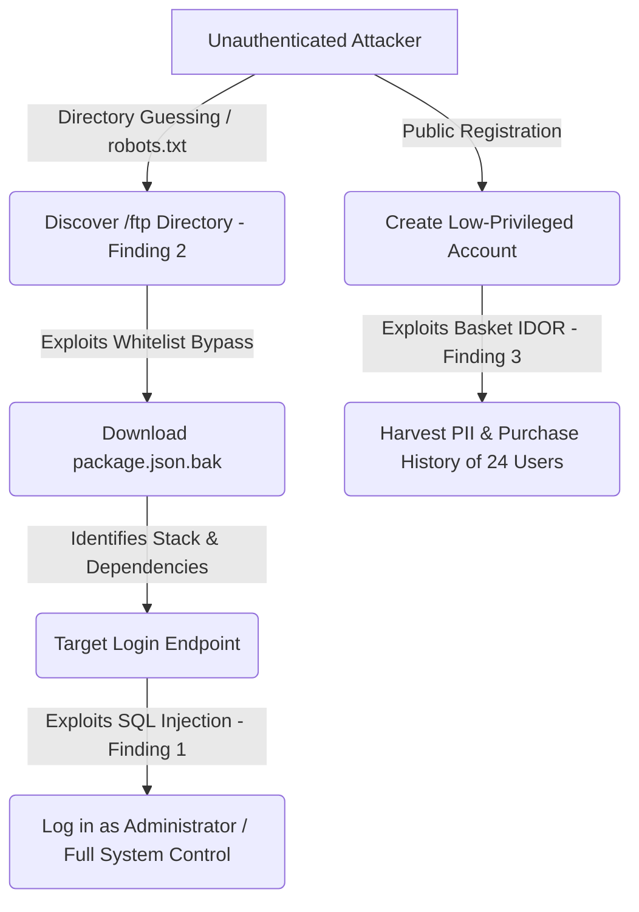

# Juice Shop Penetration Test Report
**Tester:** Victor Oduor  
**Date:** 2026-06-17  
**Target:** OWASP Juice Shop - v19.3.1 @ http://localhost:3000 (local Docker)  
**Scope:** Local instance only. Out of scope: host OS, Docker daemon, DoS testing.

## Executive Summary
These are the findings from the penetration test of OWASP Juice Shop - v19.3.1 @ http://localhost:3000 (local Docker) conducted on 2026-06-17. The assessment was scoped exclusively to the local web application instance. These findings are categorized in accordance with the OWASP Top 10 security standards and are ordered from most critical to least critical by CVSS v3.1 score.

---
## Findings Summary Table
| # | Finding | OWASP Category | Severity | CVSS v3.1 Score | CVSS Vector |
|---|---------|----------------|----------|-----------------|-------------|
| 1 | SQL Injection in Login Endpoint | A03:2021 – Injection | Critical | 9.8 | `CVSS:3.1/AV:N/AC:L/PR:N/UI:N/S:U/C:H/I:H/A:H` |
| 2 | Forced Browsing & Information Disclosure via `/ftp` | A05:2021 – Security Misconfiguration | High | 7.5 | `CVSS:3.1/AV:N/AC:L/PR:N/UI:N/S:U/C:H/I:N/A:N` |
| 3 | Insecure Direct Object Reference (IDOR) on Baskets | A01:2021 – Broken Access Control | Medium | 6.5 | `CVSS:3.1/AV:N/AC:L/PR:L/UI:N/S:U/C:H/I:N/A:N` |

---

## Assessment Methodology & Risk Matrix

### Assessment Methodology
The penetration test followed a standard web application security assessment framework:
1. **Reconnaissance & Asset Discovery:** Mapping the target surface area, identifying accessible paths (such as locating the `/ftp` folder via `robots.txt` or directory brute-forcing), and analyzing public registration forms.
2. **Vulnerability Analysis:** Probing identified endpoints (`GET /rest/basket/{id}`, `POST /rest/user/login`, and `/ftp`) for input validation weaknesses, authorization controls, and server misconfigurations.
3. **Exploitation & Data Harvesting:** Verifying findings by executing proof-of-concept exploits (null-byte bypass to retrieve configuration files, SQL Injection authentication bypass, and IDOR sequential enumeration).
4. **Impact Quantification & Reporting:** Evaluating business risk, mapping findings to Kenya's Data Protection Act 2019, and defining remediation strategies.

### Risk Rating Matrix
Risks are classified by combining **Likelihood** (ease of exploitation) and **Impact** (severity of business damage):

| Likelihood \ Impact | Low | Medium | High |
| :--- | :---: | :---: | :---: |
| **High** | Medium | High | **Critical** (Finding 1) |
| **Medium** | Low | Medium | **High** (Finding 2) |
| **Low** | Low | Low | **Medium** (Finding 3) |

- **Critical (SQL Injection):** High Likelihood & High Impact. Exploitable by unauthenticated attackers to seize full administrative session control.
- **High (Forced Browsing via `/ftp`):** Medium Likelihood & High Impact. Allows unauthenticated users to download restricted files by appending double-encoded null-bytes.
- **Medium (Basket IDOR):** Low Likelihood (requires authenticated standard token) & High Impact (exposes PII of all users).

---

## Attack Chain Narrative
An attacker can combine these vulnerabilities to systematically extract proprietary codebase configurations, bypass authentication filters, and harvest sensitive purchase histories.



1. **Phase 1 (Reconnaissance & Codebase Disclosure):** An unauthenticated attacker discovers the `/ftp` directory (Finding 2) through directory brute-forcing or analyzing the site's `robots.txt` file. Finding directory listing active, they download `package.json.bak` using a double-URL-encoded null byte (`%2500.md`) to bypass the download extension whitelist.
2. **Phase 2 (Stack Discovery & Authentication Bypass):** Analyzing the leaked `package.json.bak` reveals the backend library stack (specifically Sequelize and SQLite3). Informed of this structure, the attacker probes the `/rest/user/login` endpoint and exploits a SQL Injection vulnerability (Finding 1) with the payload `' OR 1=1--` to bypass authentication and log in directly as the administrator.
3. **Phase 3 (Privilege Escalation & Data Harvesting):** In parallel, because self-registration is publicly open, the attacker registers a standard customer account to obtain a valid JWT. They exploit Insecure Direct Object Reference (IDOR) (Finding 3) on the `/rest/basket/{id}` endpoint. By altering the basket ID path parameter, they systematically scrape purchase data for all registered users.

---

## Standalone Business Impact & Regulatory Risk
The successful execution of this attack chain has severe business and regulatory implications:

1. **Personally Identifiable Information (PII) Exposure:** The attacker successfully harvested database records and purchase histories for all 24 registered users (including customer names, emails, and transaction patterns).
2. **Regulatory Penalties (Kenya DPA 2019):** Because the compromised database contains customer PII, this constitutes a personal data breach under Kenya's Data Protection Act 2019. Under Section 43, the organization is legally mandated to report this breach to the Office of the Data Protection Commissioner (ODPC) within 72 hours of identification. Section 72 outlines administrative fines of up to KES 5,000,000 or 1% of the annual turnover, whichever is lower, for failing to safeguard user data.
3. **Proprietary Risk & Intellectual Property Exposure:** Exposing the internal `/ftp` path leaks backup files (`package.json.bak`, `coupons_2013.md.bak`), exposing system dependencies and weak coupon structures. This allows adversaries to reverse-engineer promo codes (direct financial impact) and perform targeted vulnerability testing on system packages.

---

## Finding 1 — A03:2021 — SQL Injection in Login Endpoint
**Severity:** Critical  
**CVSS v3.1:** 9.8 (`CVSS:3.1/AV:N/AC:L/PR:N/UI:N/S:U/C:H/I:H/A:H`)  
**Endpoint:** `POST /rest/user/login`

### Description
The application fails to properly sanitize the `email` field on the login form, allowing an attacker to inject SQL commands that alter the structure of the database query.

### Reproduction
1. Navigate to `http://localhost:3000/#/login`
2. Enter email: `' OR 1=1--` (with a trailing space)
3. Enter password: `anything`
4. Click Log in, or execute the following `curl` command to receive the administrator token:

```bash
curl -X POST http://localhost:3000/rest/user/login \
  -H "Content-Type: application/json" \
  -d '{"email":"'\'' OR 1=1-- ","password":"x"}'
```

### Evidence

*Figure 1: Application returns administrator session token and login data.*

### Root Cause
The database handler concatenates user-supplied email input directly into the SQL query string instead of executing a parameterized query. The injected `--` comments out the password evaluation check, and `OR 1=1` forces the clause to evaluate to true, defaulting to the first record in the database table (the administrator).

### Remediation
- Use parameterized queries or ORM equivalents (e.g., Sequelize's replacement bindings) to ensure inputs are treated strictly as data rather than SQL executable commands.
- Implement strict input validation on the email parameter using an RFC 5322-compliant regular expression before it reaches the SQL engine.

### References
- OWASP A03:2021 — Injection
- CWE-89: Improper Neutralization of Special Elements used in an SQL Command ('SQL Injection')

---

## Finding 2 — A05:2021 — Security Misconfiguration (Forced Browsing / Sensitive files via /ftp)
**Severity:** High  
**CVSS v3.1:** 7.5 (`CVSS:3.1/AV:N/AC:L/PR:N/UI:N/S:U/C:H/I:N/A:N`)  
**Endpoint:** `GET /ftp`

### Description
The server exposes directory listing and download capability for the `/ftp` route without authentication, exposing internal backup markdown documents and configuration files. Additionally, restricted file extension checks can be bypassed using URL-encoded null bytes.

### Verification of Bypass on v19.3.1
The null byte bypass remains fully functional on OWASP Juice Shop v19.3.1. When requesting `http://localhost:3000/ftp/package.json.bak%2500.md`, the web server receives the request, processes the `.md` extension check, but the low-level file system read API truncates the path at the null character, outputting the contents of `package.json.bak`.

> [!NOTE]
> **Leaked File Version Details:** The target container is running OWASP Juice Shop v19.3.1. However, the recovered `package.json.bak` file details `"version": "6.2.0-SNAPSHOT"`. This is because the backup file itself is legacy configuration debris left statically in the container's `/ftp` directory by the developers, which confirms file system authenticity.

### Reproduction
1. Direct the browser to `http://localhost:3000/ftp` or run:
   ```bash
   curl -k GET http://localhost:3000/ftp
   ```
2. Request a restricted backup file (e.g., `package.json.bak`) by bypassing extension validation with a double-encoded null byte:
   ```bash
   curl http://localhost:3000/ftp/package.json.bak%2500.md
   ```

### Evidence

*Figure 2: Active directory listing displaying files in the /ftp directory.*

**Raw Response Body Content of `coupons_2013.md.bak`:**
```text
n<MibgC7sn
mNYS#gC7sn
o*IVigC7sn
k#pDlgC7sn
o*I]pgC7sn
n(XRvgC7sn
n(XLtgC7sn
k#*AfgC7sn
q:<IqgC7sn
pEw8ogC7sn
pes[BgC7sn
l}6D$gC7ss
```

**Partial Dependency Disclosure from `package.json.bak`:**
```json
{
  "name": "juice-shop",
  "version": "6.2.0-SNAPSHOT",
  "description": "An intentionally insecure JavaScript Web Application",
  "dependencies": {
    "express": "~4.16",
    "sequelize": "~4",
    "sqlite3": "~3.1.13"
  }
}
```


*Figure 3: Successful bypass and download of coupons_2013.md.bak exposing reversible coupon structures.*

### Root Cause
The application server configuration enables directory browsing on the `/ftp` path. Furthermore, the file download validation logic is vulnerable to null-byte injection (`%00` or double-encoded `%2500`), which causes the file system API to truncate the path string and serve the `.bak` file while bypassing the application's extension whitelist check.

### Remediation
- Disable directory browsing on the web server config or the static directory serving route.
- Restrict sensitive files and backups from being kept in the web-root directories.
- Clean and sanitize input file path parameters by rejecting null bytes (`%00`, `\0`) and path traversal sequences (`../`).

### References
- OWASP A05:2021 — Security Misconfiguration
- CWE-200: Exposure of Sensitive Information to an Unauthorized Actor

---

## Finding 3 — A01:2021 — Broken Access Control (Basket IDOR)
**Severity:** Medium  
**CVSS v3.1:** 6.5 (`CVSS:3.1/AV:N/AC:L/PR:L/UI:N/S:U/C:H/I:N/A:N`)  
**Endpoint:** `GET /rest/basket/{id}`

> [!NOTE]
> **CVSS Vector Justification:** Because the `/rest/basket/{id}` route enforces authentication, the attacker must possess a valid JSON Web Token (JWT) to query the endpoint, which warrants **PR:L** (Privileges Required: Low). However, because registration is public and self-service, any external user can register a low-privileged account instantly. If your threat model considers self-registration equivalent to no barrier, the vector can be evaluated as `CVSS:3.1/AV:N/AC:L/PR:N/UI:N/S:U/C:H/I:N/A:N` (7.5 - High).

### Description
The application does not validate that the user requesting the shopping basket owns the corresponding basket ID. This allows an authenticated standard user to view arbitrary user baskets by modifying the ID parameter in the request path.

### Reproduction
1. Authenticate to the application as a normal user.
2. Intercept or construct a GET request to view your own basket (e.g., basket ID 1):
   ```bash
   curl -k GET http://localhost:3000/rest/basket/1 -H "Authorization: Bearer <user_token>"
   ```
3. Alter the basket ID parameter to `2` to view details of another customer's basket:
   ```bash
   curl -k GET http://localhost:3000/rest/basket/2 -H "Authorization: Bearer <user_token>"
   ```

### Evidence

*Figure 4: Authenticated user viewing their own shopping basket.*


*Figure 5: Accessing another user's basket by modifying the basket ID.*

### Root Cause
Modern Sequelize implementation of basket fetching retrieves basket resources based directly on the path parameter without validating if the JWT's embedded `bid` matches the path's `{id}`.

### Remediation
- Enforce strict server-side authorization checks on the `/rest/basket/{id}` route to verify that the authenticated user's basket ID from the decrypted JWT payload (`req.user.bid` or `req.user.id`) matches the requested path parameter `{id}`. Example implementation:
  ```javascript
  if (req.user.bid !== req.params.id) {
    return res.status(403).json({ error: 'Access denied: Basket ID mismatch' });
  }
  ```
- Constrain the database lookup to the user's scope. Query the database using a strict user identifier check:
  ```javascript
  Basket.findOne({ where: { id: req.params.id, UserId: req.user.id } })
  ```
- Implement automated integration tests (e.g., using Supertest and Mocha) to request mismatched basket paths and assert a `403 Forbidden` response to prevent regression of object-level access controls.
- Avoid using predictable, sequential integer keys for basket paths; utilize UUIDs or session-bound paths where appropriate.

### References
- OWASP A01:2021 — Broken Access Control
- CWE-284: Improper Access Control

---

## Recommendations (Prioritized)
1. **Immediate:** Upgrade login logic to use parameterized queries (Finding 1) to break the initial entry point of the attack chain.
2. **High:** Enforce authorization checks on `GET /rest/basket/{id}` (Finding 3) to protect customer PII from exposure.
3. **Medium:** Disable directory listing and restrict access to the `/ftp` directory (Finding 2), ensuring sensitive file extensions cannot be bypassed.

## Regulatory Context
Under Kenya's Data Protection Act 2019, the unauthorized exposure of customer PII (Finding 3) constitutes a personal data breach. Pursuant to Section 43, the data controller is required to notify the Office of the Data Protection Commissioner (ODPC) within 72 hours of identification. Under Section 72, non-compliance or failure to protect user data carries statutory penalties of up to KES 5,000,000 or 1% of the annual turnover, whichever is lower.

## Appendix A — Tooling
- Burp Suite Community Edition (v147.0.7727.101)
- curl (v8.5.0)
- OWASP Juice Shop Local Docker Container (v19.3.1)